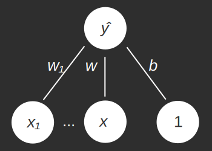
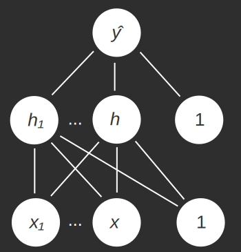
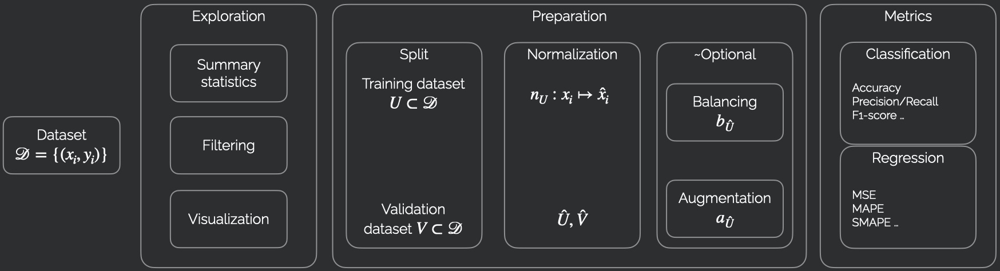
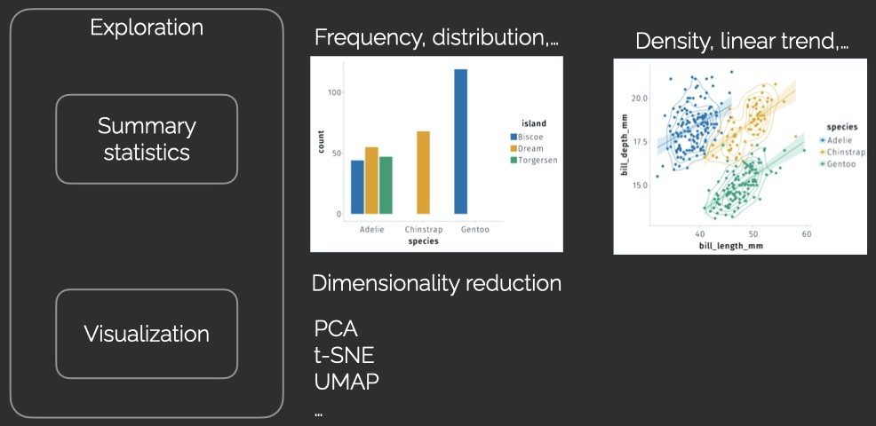
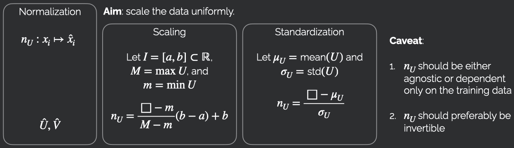
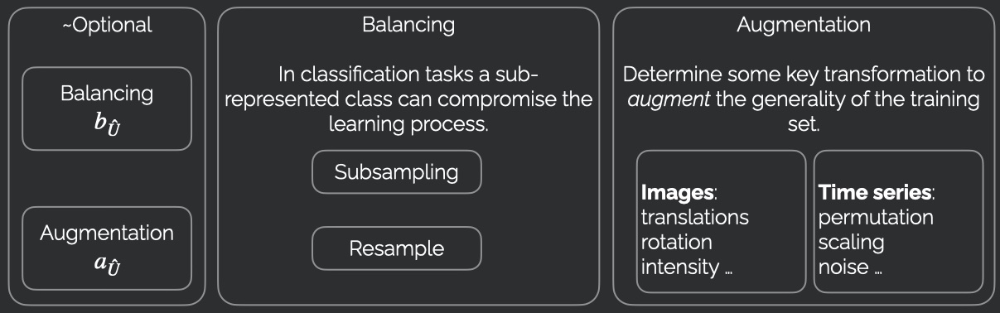
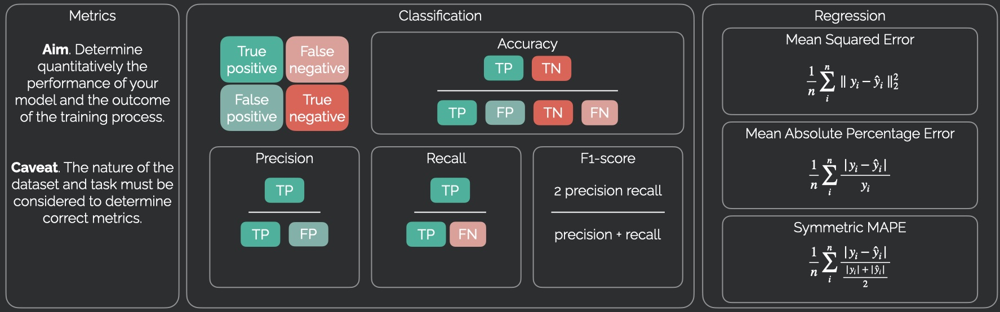
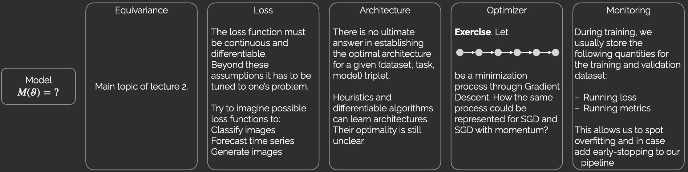

  <h1 class="almost_white">Principles of Deep Learning</h1>
  <h3 class="almost_white">Mattia Bergomi</h3>
  <h4 class="almost_white">mattia.bergomi@unito.it</h4>

---

### Table of contents

.container[
- A (very brief) historical perspective.

- A hands-on analysis of the mathematical principles underlying deep learning.

- How to build a complete data analysis pipeline.

- From equations to code.
]

---

### The overarching purpose of deep learning

.container[
The primary objective of deep learning methods is to find a function that maps an input to an output in an "optimal" way (i.e., minimizing some cost function).
]

--

.container[
Deep learning methods are particularly useful when the structure of the optimal solution is not known, but there is an ample dataset of "correct" examples.
]

--

.container[
#### Example problems

- Classification: What category does a given input belong to?

- Regression: What is the expected value of an unknown variable given a set of predictors?

- Control theory: What are the optimal control parameters given sensor data?

- ...
]

---

### The overarching strategy of deep learning
.container[
Despite the wide variety of applications of deep learning, the general strategy is always the same.
]
--
.container[
- Choose a differentiable parametric function $\hat y = f(x, p)$, where $x$ is the input and $p$ the parameters.
]
--
.container[
- Define a differentiable loss function $\mathcal{L}(\hat y)$ and minimize it with respect to $p$ (using its derivatives).
]
--
.container[
The key difficulty is the choice of the parametric function $f$.
]

---

### Early attempts

.column-left[
- The first neurally-inspired artificial decision-maker was Rosenblatt's *perceptron* (1958).

- A single unit applies a squashing, non-decreasing, nonlinear transformation to a weighted sum of input units.
]

--

.column-right[

]

---

count: false

### Early attempts

.column-left[
- The first neurally-inspired artificial decision-maker was Rosenblatt's *perceptron* (1958).

- A single unit applies a squashing, non-decreasing, nonlinear transformation to a weighted sum of input units.

- In matrix notation, $\hat y = \sigma(Wx + b)$.
]

.column-right[

]

---

count: false

### Early attempts

.column-left[
- The first neurally-inspired artificial decision-maker was Rosenblatt's *perceptron* (1958).

- A single unit applies a squashing, non-decreasing, nonlinear transformation to a weighted sum of input units.

- In matrix notation, $\hat y = \sigma(Wx + b)$.

- Limitations of the perceptron were discovered quickly.

- For instance, this network cannot learn to implement the XOR function for binary inputs. That is to say, for inputs taking values either $0$ or $1$, return $1$ if exactly one of the inputs is $1$, return $0$ otherwise. **Exercise.** Why?
]

.column-right[

]

---

### Solution to XOR problem

.container[
Let us assume that there exists a squashing, non-decreasing, nonlinear transformation $\sigma$, as well as weights $\\{w\_i\\}\_{i=1}^N$ and bias $b$, such that the associated perceptron implements the XOR function on boolean inputs.
]
--
.container[
We can also assume $N = 2$, as otherwise we could simply set $x\_i = 0$ for $i > 2$. 
]
--
.container[
$1 = \sigma(w_1 + b) > \sigma(b) = 0$ and $1 = \sigma(w_2 + b) > \sigma(w_1 + w_2 + b) = 0$, hence $w_1 > 0$ and $w_1 < 0$, which is a contradiction.
]

---

### The multilayer perceptron

The proposed solution was to "stack" perceptrons:

It can be shown that a single hidden layer perceptron with a linear readout can approximate any function, given sufficiently many hidden units (Hornik, 1991).

--

.column-right[
In formulas:

$$ h = \sigma(W_1x + b_1)$$
$$ \hat y = W_2h + b_2$$
]

--

.column-right[
**Exercise.** How can one compute XOR with this architecture? For simplicity, take as squashing nonlinearity the step function
$$
\sigma(t) = \begin{cases}
1 &\text{ if } t > 0,\\\\
0 &\text{ otherwise.}
\end{cases}
$$
]

--

.column-right[
The matrices $W_1, W_2$ and the vectors $b_1, b_2$ are our parameters. How can we optimize $\mathcal{L}(\hat y)$ as a function of the parameters?
]

---

### A concrete example

.column-left[
Let $x, y$ be vectors. Let us define

$$
\begin{aligned}
\tilde h &= W_1x + b_1\\\\
h &= \sigma(\tilde h)\\\\
\hat y &= W_2h + b_2
\end{aligned}
$$
]

---

count: false

### A concrete example

.column-left[
Let $x, y$ be vectors. Let us define

$$
\begin{aligned}
\tilde h &= W_1x + b_1\\\\
h &= \sigma(\tilde h)\\\\
\hat y &= W_2h + b_2
\end{aligned}
$$

We wish to find parameters such that $\hat y$ is as close as possible to $y$.

We can consider a simple square norm loss, that is to say, $\mathcal{L} = \lVert y - \hat y \rVert^2$.
]

--

.column-right[
Computing derivatives is a simple, but laborious, application of the chain rule.

$$
\begin{aligned}
&\frac{\partial \mathcal{L}}{\partial \hat y} = 2(\hat y - y)^\* \\\\
&\phantom{\frac{\partial \mathcal{L}}{\partial W_2} = \frac{\partial \mathcal{L}}{\partial \hat y}\frac{\partial \hat y}{\partial W_2} = h\frac{\partial \mathcal{L}}{\partial \hat y}}\\\\
&\phantom{\frac{\partial \mathcal{L}}{\partial b_2} = \frac{\partial \mathcal{L}}{\partial \hat y}\frac{\partial \hat y}{\partial b_2} = \frac{\partial \mathcal{L}}{\partial \hat y}}\\\\
&\phantom{\frac{\partial \mathcal{L}}{\partial h} = \frac{\partial \mathcal{L}}{\partial \hat y}\frac{\partial \hat y}{\partial h} = \frac{\partial \mathcal{L}}{\partial \hat y}W_2}\\\\
&\phantom{\frac{\partial \mathcal{L}}{\partial \tilde h} = \frac{\partial \mathcal{L}}{\partial h}\frac{\partial h}{\partial \tilde h} = \frac{\partial \mathcal{L}}{\partial h} \odot \sigma'(\tilde h)^\* }\\\\
&\phantom{\frac{\partial \mathcal{L}}{\partial W_1} = \frac{\partial \mathcal{L}}{\partial \tilde h}\frac{\partial \tilde h}{\partial W_1} = x \frac{\partial \mathcal{L}}{\partial \tilde h}}\\\\
&\phantom{\frac{\partial \mathcal{L}}{\partial b_1} = \frac{\partial \mathcal{L}}{\partial \tilde h}\frac{\partial \tilde h}{\partial b_1} = \frac{\partial \mathcal{L}}{\partial \tilde h}}
\end{aligned}
$$

]

---

count: false

### A concrete example

.column-left[
Let $x, y$ be vectors. Let us define

$$
\begin{aligned}
\tilde h &= W_1x + b_1\\\\
h &= \sigma(\tilde h)\\\\
\hat y &= W_2h + b_2
\end{aligned}
$$

We wish to find parameters such that $\hat y$ is as close as possible to $y$.

We can consider a simple square norm loss, that is to say, $\mathcal{L} = \lVert y - \hat y \rVert^2$.
]

.column-right[
Computing derivatives is a simple, but laborious, application of the chain rule.

$$
\begin{aligned}
&\frac{\partial \mathcal{L}}{\partial \hat y} = 2(\hat y - y)^\* \\\\[0.5cm]
&\frac{\partial \mathcal{L}}{\partial W_2} = \frac{\partial \mathcal{L}}{\partial \hat y}\frac{\partial \hat y}{\partial W_2} = h\frac{\partial \mathcal{L}}{\partial \hat y}\\\\[0.2cm]
&\frac{\partial \mathcal{L}}{\partial b_2} = \frac{\partial \mathcal{L}}{\partial \hat y}\frac{\partial \hat y}{\partial b_2} = \frac{\partial \mathcal{L}}{\partial \hat y}\\\\[0.2cm]
&\frac{\partial \mathcal{L}}{\partial h} = \frac{\partial \mathcal{L}}{\partial \hat y}\frac{\partial \hat y}{\partial h} = \frac{\partial \mathcal{L}}{\partial \hat y}W_2\\\\[0.2cm]
&\phantom{\frac{\partial \mathcal{L}}{\partial \tilde h} = \frac{\partial \mathcal{L}}{\partial h}\frac{\partial h}{\partial \tilde h} = \frac{\partial \mathcal{L}}{\partial h} \odot \sigma'(\tilde h)^\* }\\\\
&\phantom{\frac{\partial \mathcal{L}}{\partial W_1} = \frac{\partial \mathcal{L}}{\partial \tilde h}\frac{\partial \tilde h}{\partial W_1} = x \frac{\partial \mathcal{L}}{\partial \tilde h}}\\\\
&\phantom{\frac{\partial \mathcal{L}}{\partial b_1} = \frac{\partial \mathcal{L}}{\partial \tilde h}\frac{\partial \tilde h}{\partial b_1} = \frac{\partial \mathcal{L}}{\partial \tilde h}}
\end{aligned}
$$

]

---

count: false

### A concrete example

.column-left[
Let $x, y$ be vectors. Let us define

$$
\begin{aligned}
\tilde h &= W_1x + b_1\\\\
h &= \sigma(\tilde h)\\\\
\hat y &= W_2h + b_2
\end{aligned}
$$

We wish to find parameters such that $\hat y$ is as close as possible to $y$.

We can consider a simple square norm loss, that is to say, $\mathcal{L} = \lVert y - \hat y \rVert^2$.
]

.column-right[
Computing derivatives is a simple, but laborious, application of the chain rule.

$$
\begin{aligned}
&\frac{\partial \mathcal{L}}{\partial \hat y} = 2(\hat y - y)^\* \\\\[0.5cm]
&\frac{\partial \mathcal{L}}{\partial W_2} = \frac{\partial \mathcal{L}}{\partial \hat y}\frac{\partial \hat y}{\partial W_2} = h\frac{\partial \mathcal{L}}{\partial \hat y}\\\\[0.2cm]
&\frac{\partial \mathcal{L}}{\partial b_2} = \frac{\partial \mathcal{L}}{\partial \hat y}\frac{\partial \hat y}{\partial b_2} = \frac{\partial \mathcal{L}}{\partial \hat y}\\\\[0.2cm]
&\frac{\partial \mathcal{L}}{\partial h} = \frac{\partial \mathcal{L}}{\partial \hat y}\frac{\partial \hat y}{\partial h} = \frac{\partial \mathcal{L}}{\partial \hat y}W_2\\\\[0.5cm]
&\frac{\partial \mathcal{L}}{\partial \tilde h} = \frac{\partial \mathcal{L}}{\partial h}\frac{\partial h}{\partial \tilde h} = \frac{\partial \mathcal{L}}{\partial h} \odot \sigma'(\tilde h)^\* \\\\[0.5cm]
&\phantom{\frac{\partial \mathcal{L}}{\partial W_1} = \frac{\partial \mathcal{L}}{\partial \tilde h}\frac{\partial \tilde h}{\partial W_1} = x \frac{\partial \mathcal{L}}{\partial \tilde h}}\\\\
&\phantom{\frac{\partial \mathcal{L}}{\partial b_1} = \frac{\partial \mathcal{L}}{\partial \tilde h}\frac{\partial \tilde h}{\partial b_1} = \frac{\partial \mathcal{L}}{\partial \tilde h}}
\end{aligned}
$$

]

---

count: false

### A concrete example

.column-left[
Let $x, y$ be vectors. Let us define

$$
\begin{aligned}
\tilde h &= W_1x + b_1\\\\
h &= \sigma(\tilde h)\\\\
\hat y &= W_2h + b_2
\end{aligned}
$$

We wish to find parameters such that $\hat y$ is as close as possible to $y$.

We can consider a simple square norm loss, that is to say, $\mathcal{L} = \lVert y - \hat y \rVert^2$.
]

.column-right[
Computing derivatives is a simple, but laborious, application of the chain rule.

$$
\begin{aligned}
&\frac{\partial \mathcal{L}}{\partial \hat y} = 2(\hat y - y)^\* \\\\[0.5cm]
&\frac{\partial \mathcal{L}}{\partial W_2} = \frac{\partial \mathcal{L}}{\partial \hat y}\frac{\partial \hat y}{\partial W_2} = h\frac{\partial \mathcal{L}}{\partial \hat y}\\\\[0.2cm]
&\frac{\partial \mathcal{L}}{\partial b_2} = \frac{\partial \mathcal{L}}{\partial \hat y}\frac{\partial \hat y}{\partial b_2} = \frac{\partial \mathcal{L}}{\partial \hat y}\\\\[0.2cm]
&\frac{\partial \mathcal{L}}{\partial h} = \frac{\partial \mathcal{L}}{\partial \hat y}\frac{\partial \hat y}{\partial h} = \frac{\partial \mathcal{L}}{\partial \hat y}W_2\\\\[0.5cm]
&\frac{\partial \mathcal{L}}{\partial \tilde h} = \frac{\partial \mathcal{L}}{\partial h}\frac{\partial h}{\partial \tilde h} = \frac{\partial \mathcal{L}}{\partial h} \odot \sigma'(\tilde h)^\* \\\\[0.5cm]
&\frac{\partial \mathcal{L}}{\partial W_1} = \frac{\partial \mathcal{L}}{\partial \tilde h}\frac{\partial \tilde h}{\partial W_1} = x \frac{\partial \mathcal{L}}{\partial \tilde h}\\\\[0.2cm]
&\frac{\partial \mathcal{L}}{\partial b_1} = \frac{\partial \mathcal{L}}{\partial \tilde h}\frac{\partial \tilde h}{\partial b_1} = \frac{\partial \mathcal{L}}{\partial \tilde h}
\end{aligned}
$$
]

---

### A general recipe: backpropagation

.container[
Backpropagation is the generalization of the above technique.

- During the forward pass, we compute *and store* all intermediate values from $x$ to $\hat y$.

- For each one of these values, we compute the derivatives of the loss with respect to it, in *reversed order*.

- In the practical session, we will implement it.
]

---

### Automatic differentiation

.container[
- In the above example, given a *primitive* $v = g(u)$ (matrix multiplication, addition, or pointwise nonlinearity), we wish to compute $\frac{\partial \mathcal{L}}{\partial u}$ as a function of $\frac{\partial \mathcal{L}}{\partial v}$.
]
--
.container[
- This is done by composing differentials, i.e. $\frac{\partial \mathcal{L}}{\partial u} = \frac{\partial \mathcal{L}}{\partial v}\frac{\partial v}{\partial u}$.
]
--
.container[
- Equivalently, $\left(\frac{\partial \mathcal{L}}{\partial u}\right)^\* = \left(\frac{\partial v}{\partial u}\right)^\* \left(\frac{\partial \mathcal{L}}{\partial v}\right)^\*$.
]
--
.container[
- When computing the *primitive* $g$, we also compute and store the adjoint operator $\left(\frac{\partial u}{\partial v}\right)^*$.
]
--
.container[
- During the reverse pass, we compose all adjoint operators.
]
--
.container[
- Automatic differentiation libraries perform this procedure automatically on a *directed acyclic graph* representing our computation.
]

---

count: false

### Automatic differentiation

.container[
- In the above example, given a *primitive* $v = g(u)$ (matrix multiplication, addition, or pointwise nonlinearity), we wish to compute $\frac{\partial \mathcal{L}}{\partial u}$ as a function of $\frac{\partial \mathcal{L}}{\partial v}$.
]

.container[
- This is done by composing differentials, i.e. $\frac{\partial \mathcal{L}}{\partial u} = \frac{\partial \mathcal{L}}{\partial v}\frac{\partial v}{\partial u}$.
]

.container[
- Equivalently, $\left(\frac{\partial \mathcal{L}}{\partial u}\right)^\* = \left(\frac{\partial v}{\partial u}\right)^\* \left(\frac{\partial \mathcal{L}}{\partial v}\right)^\*$.
]

.container[
- When computing the *primitive* $g$, we also compute and store the adjoint operator $\left(\frac{\partial u}{\partial v}\right)^*$.
]

.container[
- During the reverse pass, we compose all adjoint operators.
]

.container[
- Automatic differentiation libraries perform this procedure automatically on a *directed acyclic graph* representing our computation.
]

---

### The road so far

.container[
- We have constructed a parametric function $\hat y = f(x, p)$: the *multilayer perceptron*.

- The parameters $p$ contain all the weight matrices $W$ and bias vectors $b$.

- Given a loss $\mathcal{L}(y, \hat y)$ we can compute its derivatives with respect to $p$ via backpropagation.
]

---

### Stochastic (i.e., batched) gradient descent

- Let us now consider a dataset $\mathcal{D} = \\{(x\_i, y\_i)\\}\_{i=1}^N$.

- We wish to minimize $\mathcal{L}(y_i, \hat y_i)$, across all $(x_i, y_i) \in \mathcal{D}$, where $\hat y_i = f(x_i, p)$.

- Intuitive approach: compute $\frac{\partial \mathcal{L}}{\partial p}$ directly and apply gradient descent.

--

Unfortunately, computing $\frac{\partial \mathcal{L}}{\partial p}$ requires averaging over the whole dataset, which can be very expensive.

A more practical approach (batched optimization) is to the following.

- Compute $\frac{\partial \mathcal{L}}{\partial p}$ for a given subset (batch) of data.

- Apply a step of gradient descent.

- Select a novel batch of data and repeat the procedure.

--

#### Remark

In the above procedure, gradient descent on a batch of data is not the only option.

Many other batched optimizers can be used.

---

### The overall procedure

- Start with a dataset of samples $\\{x\_i\\}\_{i=1}^N$ and correct outcomes $\\{y\_i\\}\_{i=1}^N$.

--

- Define a parametric function $\hat y = f(x, p)$ (multilayer perceptron, for today).

--

- Define a loss $\mathcal{L}(y, \hat y)$.

--

- Find optimal parameters using a batched optimizer and backpropagation (training).

--

- Test the trained multilayer perceptron on novel samples.

---

### From data to prediction

---

### From data to prediction

---

### From data to prediction

---

### From data to prediction

---

### From data to prediction

---

### From data to prediction

---

### From data to prediction

---

layout: false
class: center

mattia.bergomi@unito.it
