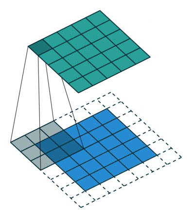
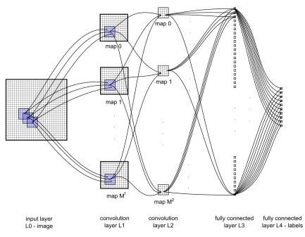
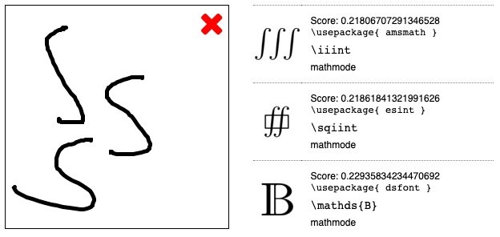
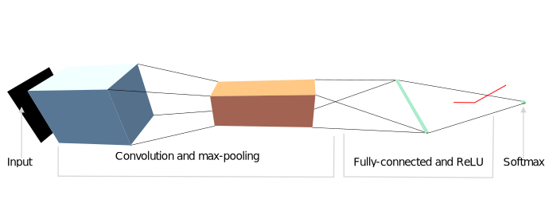
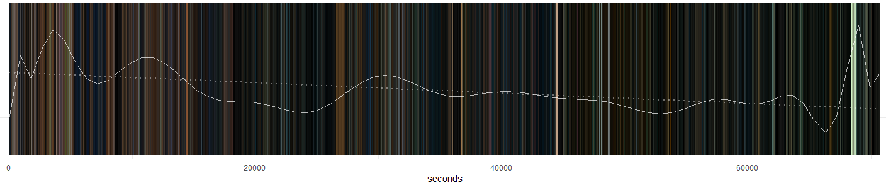
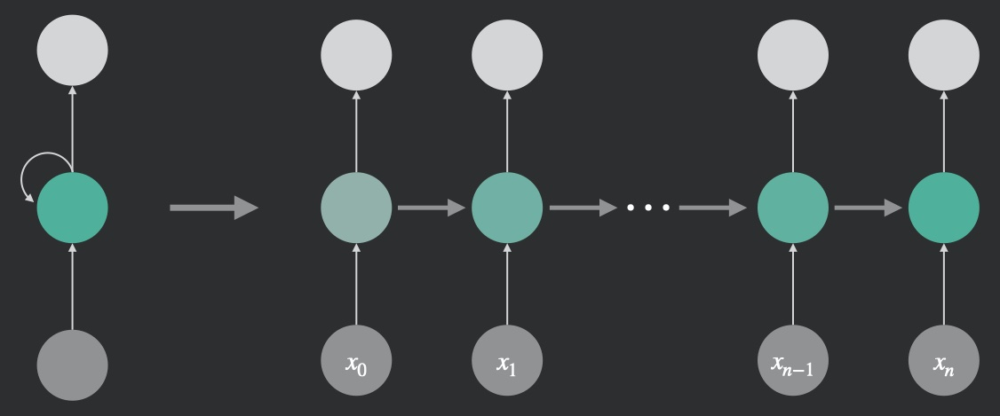
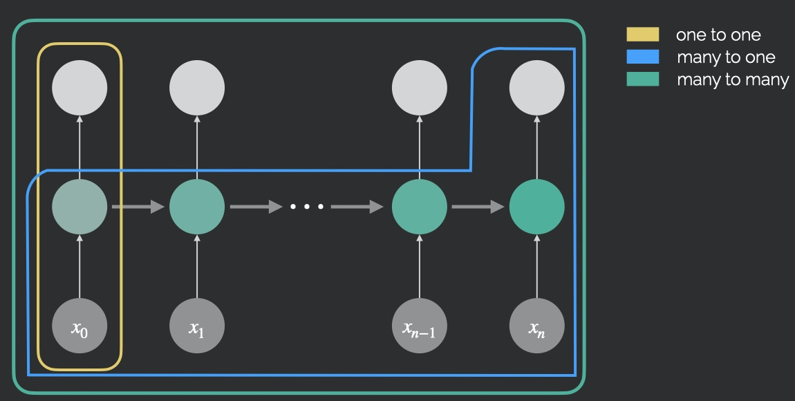
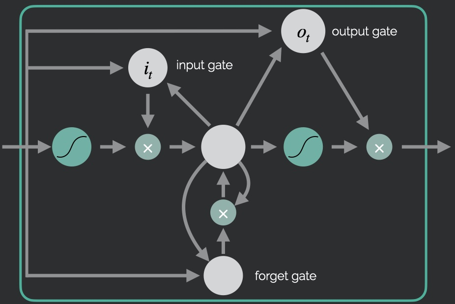
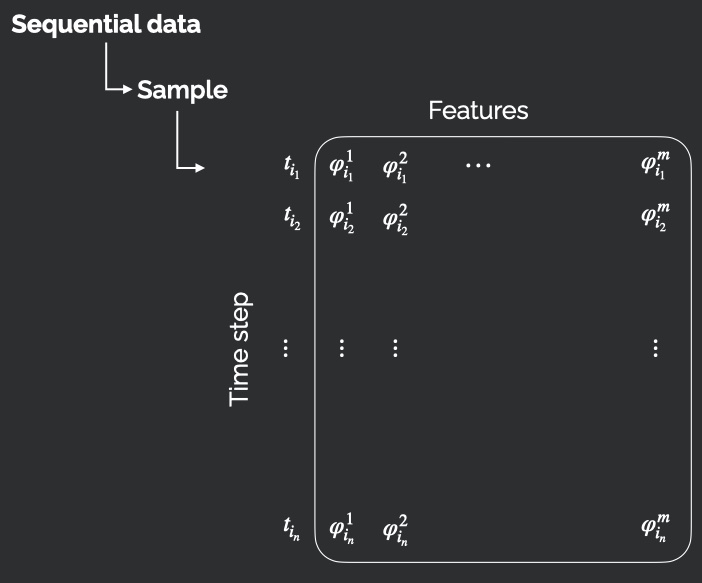

  <h1 class="almost_white">Knowledge Injection in Deep Learning</h1>
  <h3 class="almost_white">Mattia Bergomi</h3>
  <h4 class="almost_white">mattia.bergomi@unito.it</h4>

---

### Table of contents

.container[
- A short recap.

- Injecting knowledge via equivariance and locality.

- Convolutional and recurrent neural networks.
]

---

### Recap

.column-left[
In the previous lecture, we developed the following plan.

- Choose a differentiable parametric function $\hat y = f(x, p)$, where $x$ is the input and $p$ the parameters.

- Define a differentiable loss function $\mathcal{L}(\hat y)$ and minimize it with respect to $p$ (using its derivatives).

- Compute derivatives of $\mathcal{L}$ with respect to $p$ and use them to find optimal parameters. 
]

--

.column-right[
**Perceptron.**

]

---

count: false

### Recap

.column-left[
In the previous lecture, we developed the following plan.

- Choose a differentiable parametric function $\hat y = f(x, p)$, where $x$ is the input and $p$ the parameters.

- Define a differentiable loss function $\mathcal{L}(\hat y)$ and minimize it with respect to $p$ (using its derivatives).

- Compute derivatives of $\mathcal{L}$ with respect to $p$ and use them to find optimal parameters. 
]

.column-right[
**Multilayer perceptron.**

]

---

### Drawbacks of multilayer perceptron

.column-left[
- The multilayer perceptron is sometimes called a *dense* architecture, as all units in a given layer are connected to all units in the following layer.

- This is catastrophic for high-dimensional data (e.g. images).

- For example, if two consecutive layers represent a 1024 x 1024 grayscale image each, we would get $1024^4 \approx 10^{12}$ parameters for the corresponding weights matrix.
]

.column-right[
**Multilayer perceptron.**

]

---

### Knowledge injection

.column-left[
Multilayer perceptrons, while versatile, ignore the structure of the problem at hand.

Knowledge about the structure of natural images suggests two key principles to mitigate this explosion in the number of parameters.

- **Locality.** Each pixel should only receive inputs from nearby pixels.

- **Equivariance.** A shift in the input image should correspond to a shift in the output image.
]

--

.column-right[

<small>Image credits: Đặng Hà Thế Hiển</small>

]

---

### Convolutions in formulas

.container[
In practice, given an input grayscale image $I$ and a weight matrix $W$ with indices $K\_1 \times K\_2$, we obtain an output grayscale image

$$J[i\_1, i\_2] = \sum\_{k\_1 \in K\_1} \sum\_{k\_2 \in K\_2} W[k\_1, k\_2] I[i\_1-k\_1, i\_2-k\_2].$$
]

--

.container[
In real use cases, images will have an extra dimension: channels.
- Red, green, blue values for input images.
- Abstract channels for images in intermediate layers of a network.

Let $C\_1, C\_2$ be the input and output channels, respectively.

$$J[i\_1, i\_2, c\_2] = \sum\_{c\_1 \in C\_1} \sum\_{k\_1 \in K\_1} \sum\_{k\_2 \in K\_2} W[k\_1, k\_2, c\_1, c\_2] I[i\_1-k\_1, i\_2-k\_2, c_1].$$
]

---

### Beyond images: 1D and 3D convolutions

Images are not the only application of convolutional neural networks.

--

#### 1-dimensional convolutions

Useful for working with time series, where index $i\_1$ represents time.

$$J[i\_1, c\_2] = \sum\_{c\_1 \in C\_1} \sum\_{k\_1 \in K\_1} W[k\_1, c\_1, c\_2] I[i\_1-k\_1, c_1].$$

--

#### 3-dimensional convolutions

Useful for working with voxel images, or sequences of images (short movies), where index $i\_1$ represents time, indices $i\_2, i\_3$ represent image dimensions.

$$J[i\_1, i\_2, i\_3 c\_2] = \sum\_{c\_1 \in C\_1} \sum\_{k\_1 \in K\_1} \sum\_{k\_2 \in K\_2} \sum\_{k\_3 \in K\_3} W[k\_1, k\_2, k\_3, c\_1, c\_2] I[i\_1-k\_1, i\_2-k\_2, i\_3-k\_3, c_1].$$

---

### Convolution is just another building block

<small>Cireşan, Meier, Masci, Gambardella and Schmidhuber - 2011</small>

--

.right-column[
#### Everything else stays the same

- Loss function.

- Backpropagation.

- Batched optimization.

- Overall pipeline.
]

---

### Building a convolutional architecture

.container[
  Convolution is not the only operation typically used as building block of a convolutional architecture.
]

--

.column-right.long[

]

.container[
  Knowledge injection is not limited to informing the network of the dimensionality of the data points.
  We are also interested in:

  - controlling the *receptive field* of convolutions;
  - inform the model of broader classes of invariance or equivariance (e.g., rotations);
  - compose the convolution-based part of the architecture with other networks (e.g., dense classifier).
]

---

### Building a convolutional architecture - locality

.column-left[
  **Exercise**. Can you justify the following result obtained from [Detexify](https://detexify.kirelabs.org/classify.html)?
]

.column-right[
  
]

---
count:false

### Building a convolutional architecture - locality

.column-left[
  The receptive field of convolutional layers can be controlled through parameters such as stride and dilation. 
  However, it is common to downsample the layer's input via *pooling* operations
]

--

.column-right.long[
  
  
<small>Image credits: Huo Yingge, Imran Ali and Kang-Yoon Lee</small>

  
]

---

### Building a convolutional architecture - invariance and equivariance

.column-left[
  Oftentimes, problems present more symmetries than translation. It is important to make the model aware of these constraints to reduce the dimensionality of the problem and thus make the learning swifter and hopefully converge to a more general solution.
]

--

.column-right.long[
    
  
<small>Image credits: Jamil Ahmad, Khan Muhammad and Sung Wook Baik</small>

]

--

.column-left[
  It is also possible to take advantage of *functional* computational topology to prime a convolutional network with equivariant filters.
]

---
count:false

### Building a convolutional architecture - invariance and equivariance

.column-left[
  Oftentimes, problems present more symmetries than translation. It is important to make the model aware of these constraints to reduce the dimensionality of the problem and thus make the learning swifter and hopefully converge to a more general solution.
]

.column-right.long[
    
  
<small>Bergomi, Frosini, Giorgi, Quercioli (2019)</small>

]

.column-left[
  It is also possible to take advantage of *functional* computational topology to prime a convolutional network with equivariant filters.
]

---

### Building a convolutional architecture - composability

---

### Summary on Convolutional Neural Networks (CNNs)

.container[
- Multilayer perceptron requires many parameters for high-dimensional data (e.g., images).

- CNNs require fewer parameters, thanks to the principles of locality and equivariance.

- CNNs are suitable for problems with underlying symmetries (shifts in time or space).

- The general principles of deep learning apply also for CNNs, we simply added a novel building blocks (convolution) to the ones we had (matrix multiplication, addition, and pointwise nonlinearity).
]

---

### Recurrence

.container[
  As convolutional networks were originally designed to work on images, sequential data are the natural domain of recurrent neural networks (RNNs).
]

--

.container[
- Sequential data and recurrent architectures

- Backpropagation through time

- Long-Short Time Memory (LSTM) and Gated Recurrent Units (GRU)

- Data preparation
]

---

### Sequential data and recurrent architectures

.container[
  Data are sequential when their underlying temporal dynamics if more relevant than the information carried by each individual data point.
]

--

.container[
  
  
<small>Image credits: Tommaso Buonocore</small>

  
]

---

### Sequential data and recurrent architectures

.column-left[
  The main idea is to add knowledge of the immediate past to the current state of the network.
]

.column-right[
  
]

---

### Sequential data and recurrent architectures - unfolding

.container[
  It is natural to unfold a recurrent architecture in time.

  **Exercise.** Why is this operation relevant?

  
]

---

### Sequential data and recurrent architectures - relationships

.container[
  
]

--

.container[
  In what situations a one-to-many should be favoured over a many-to-many architecture?
]

---

### Backpropagation through time

.container[
  Let $x_t$, $h_t$, and $\hat{y}_t$ be the input, hidden state and output at time $t$, respectively.
  Then, given hidden and output weight matrices $w_h$ and $w_y$, we have

  $$
    h\_t = f(x\_t, h\_{t-1}, w\_h)
  $$
  $$
    \hat{y}\_t = g(h\_t, w\_y)
  $$
]

--

.container[
  We need to compute derivatives for the loss function:
  
  $$
    \mathcal{L}(x\_1,\dots, x\_T, y\_1, \dots, y\_T, w\_h, w\_y) = \frac{1}{T}\sum_{t=1}^T l(y\_t, \hat{y}\_t)
  $$
]

--

.container[
  $$
  \begin{aligned}
    \frac{\partial \mathcal{L}}{\partial w\_h}&=\frac{1}{T}\sum\_{t=1}^T\frac{\partial l(y\_t, \hat{y}\_t)}{\partial w_h} \\\\
    &=\frac{1}{T}\sum\_t\frac{\partial l(y\_t, \hat{y}\_t)}{\partial\hat{y}\_t}\frac{\partial g(h\_t, w\_y)}{\partial h\_t}\frac{\partial h\_t}{\partial w\_h}
  \end{aligned}
  $$
]

---

### Backpropagation through time

.container[
The term $\frac{\partial h\_t}{\partial w\_h}$ is particularly tricky to compute:

$$
\begin{aligned}
\frac{\partial h\_t}{\partial w\_h} &= \frac{\partial f(x\_t, h\_{t-1}, w\_h)}{\partial w\_h} + \frac{\partial f(x\_t, h\_{t-1}, w\_h)}{\partial h\_{t-1}}\frac{\partial h\_{t-1}}{\partial w\_h}\\\\
&= \frac{\partial f(x\_t, h\_{t-1}, w\_h)}{\partial w\_h} + \sum\_{i=1}^{t-1}(\prod\_{j=i+1}^t \frac{\partial f(x\_j, h\_{j-1}, w\_h)}{\partial h\_{j-1}})\frac{\partial f(x\_i, h\_{i-1}, w\_h)}{\partial w\_h}
\end{aligned}
$$
]

--

.container[
  This computation can be extremely complex. For this reason, it is often either deterministically or randomly truncated. Pathological behaviors such as vanishing and exploding gradients can be caused by the numerical instability of the computation showcased above.
]

---

### Long-Short Time Memory (LSTM)

.column-left[
  LSTMs allow a recurrent network to retain more easily past information.
]

--

.column-right[
  
]

---

### Data preparation

.container[
  
]

--

.container[
  The target $y$ should be created according to the task:
  
  - labels could be associated to time stamps in the sequence;
  - future frames can be forecasted $y = \\{\varphi\_{i\_{n+k}}^1,\dots,\varphi\_{i\_{n+k}}^m\\}$;
  - multiple future points can be forecasted at the same time.
]

---

### Caveats

.container[
  
1. Always implement *naive* models for comparison;

2. Do not rely too much on visualization of long time series;

3. Remember that prediction does not equal generation.
]

---

### Summary on Recurrent Neural Networks (RNNs)

.container[
- Sequential data require memory: past dynamics strongly influence the present.

- Although it is possible to compute gradients for RNNs, it has high computational cost, and can lead to vanishing and exploding gradients.

- LSTMs (and GRU) can be used to alleviate these issues.
]

---

layout: false
class: center

mattia.bergomi@unito.it
