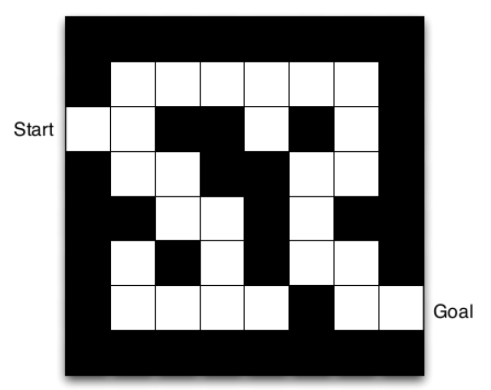
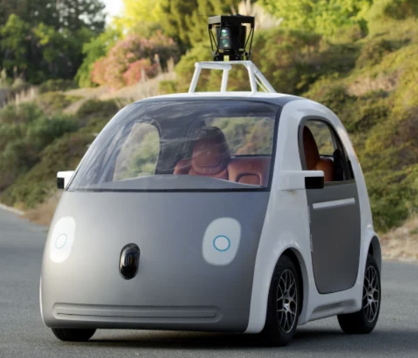
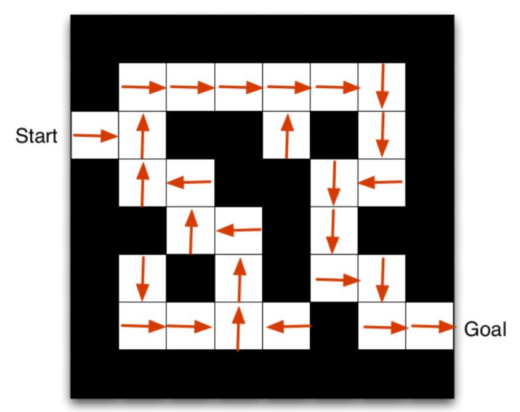
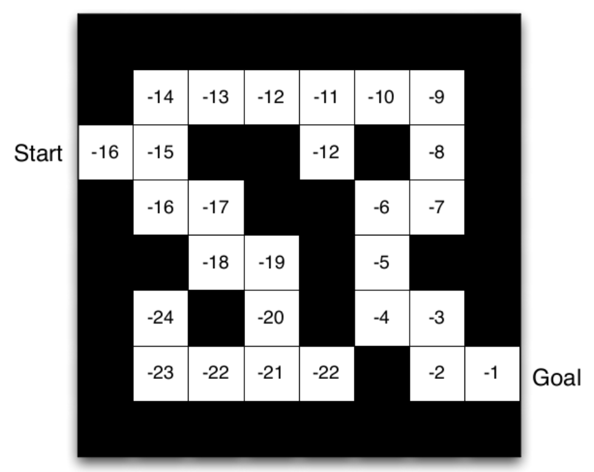
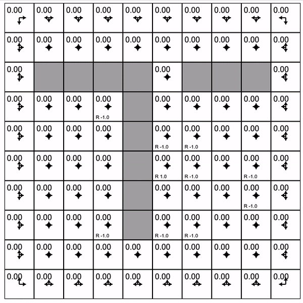
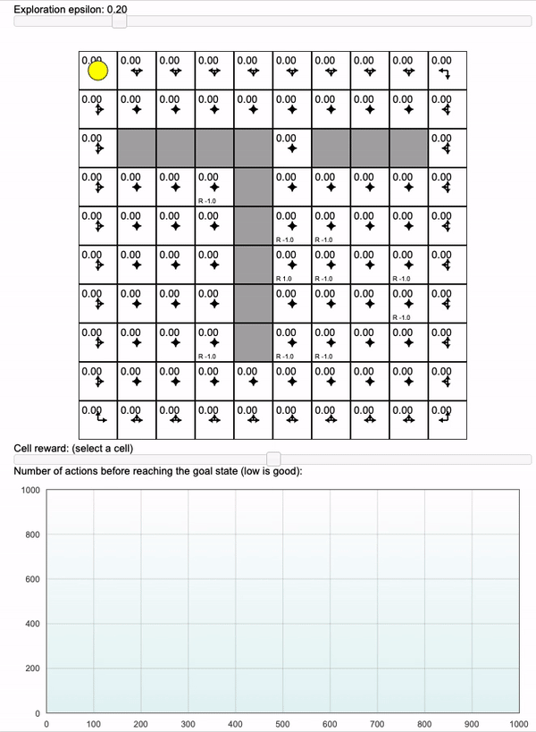
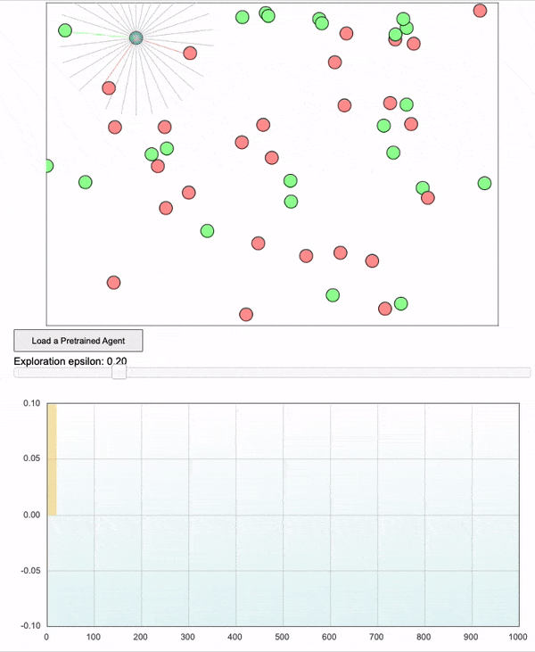
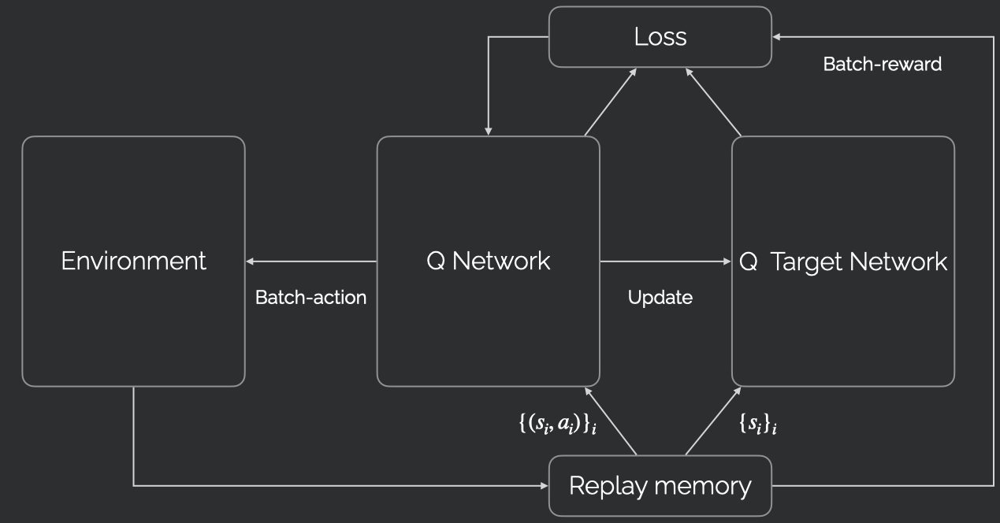
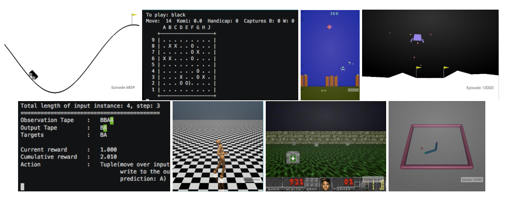

<div class="row" style="width:100%;margin-top:200px">
  <h1 class="almost_white">Reinforcement Learning</h1>
  <h3 class="almost_white">Mattia Bergomi</h3>
  <h4 class="almost_white">mattia.bergomi@unito.it</h4>
</div>

---

### Table of contents

- Introduction to Reinforcement Learning (RL).
- Formalization of an RL problem.
- The Bellman equation.
- Learning the structure of the environment:
  - model-free,
  - model-based,
  - embedding.
- Combining Deep Learning and RL.
- Continuous problems.
- Control theory.
- Conclusions.

---

### Introduction

.container[
The goal of RL is to train an agent to solve a task by giving it rewards (*reinforcements*) when it behaves correctly.

Its origins are rooted in behavioral psychology, where rewards can be used to reinforce a given behavior.
]

<br>

--

<div style="float:left; width: 30%; margin-right:5%;">
  
  <p><small>Image Credits: Microsoft Research</small></p>
</div>

--

<div style="float:left; width: 30%; margin-right:5%;">
  
  <p><small>Image Credits: Aditya Ganeshan</small></p>
</div>

--

<div style="float:left; width: 30%;">
  
  <p><small>Image Credits: Time</small></p>
</div>

---

### Problem description

- Set of states $s_1, \dots, s_n$ describing the current *situation* of the agent.

--

- Set of actions $a_1, \dots, a_m$ describing all possible actions the agent can take.

--

- A transition probability $p(s' \, | \, s, \, a)$ of landing in new state, given old state and action.

--

- An expected reward function $R(s, \, a)$, received upon selecting action $a$ in state $s$.

--

- **Important.** The current state encodes *all relevant information* (Markov property).

---

### Policy and value

.container[
The objective of the agent is to develop a policy $\pi(a \, | \, s)$:<br>
the probability of choosing a given action $a_k$ when in state $s_i$.

For a given policy, there is a notion of *discounted future rewards*:

$$\sum\_{i=0}^\infty \gamma ^ i R\_{t+i},$$

where $\gamma \in (0, 1)$ represents how much we value present reward more than future reward.
]

--

.container[
Using the discount factor $\gamma$, we can compute two important functions associated to the policy $\pi$:
- the discounted future reward of a state $V(s)$,
- the discounted future reward of a state-action pair $Q(s, \, a)$.
]

---

### Value function and Bellman equation

.container[
The value function $V$ and the state-action value function $Q$ are connected by the following equations.
$$
\begin{aligned}
V(s) &= \sum\_{a} \pi(a \, | \, s) Q(s, \, a) \\\\
Q(s, \, a) &= R(s, \, a) + \gamma \sum\_{s'} p(s' \, | \, s, \, a) V(s')
\end{aligned}
$$
]

--

.container[
Assuming that the policy $\pi$ is optimal (always chooses the action with maximum value), the associated functions $V\_\*$ and $Q\_\*$ respect the Bellman equation:
$$
\begin{aligned}
V\_\*(s) &= \max\_{a} Q\_\*(s, \, a) \\\\
&= \max\_{a}  R(s, \, a) + \gamma\sum\_{s'} p(s' \, | \, s, \, a) V\_\*(s').
\end{aligned}
$$

]

---

### Maze example

<p><small>Image Credits: Aditya Ganeshan</small></p>

<div style="float:left; width: 30%; margin-right:5%;">
  
</div>

--

<div style="float:left; width: 30%; margin-right:5%;">
  
</div>

--

<div style="float:left; width: 30%;">
  
</div>

---

### How to compute the value functions?

There are broadly three classes of methods to compute the value function.

.container[
**Model free.** Do not attempt to learn the structure of the task, and simply update the $Q$ function while performing the task, using some learning rate $\rho$:
$$
\begin{aligned}
&\Delta = R + \gamma V(s') - Q(s, a)\\\\
&Q(s, a) \mathrel{+}= \rho \Delta.
\end{aligned}
$$
Drawback: hard to adjust to changes in the task.
]

--

.container[
**Model based.** Learn all transition probabilities $p(s' \, | \, s, \, a)$ and use the information to plan ahead (think: game of chess).

Drawback: unfeasible for large state spaces.
]

--

.container[
**Embedding.** Embed all states $s_1, \dots, s_n$ in an abstract space, so that nearby states have similar value. For instance, group together states that have similar future trajectories (successor representation).

Drawback: in principle, it can be difficult to build an embedding.
]

---

### Recap and practice

.column-left[

<p><small>Credits: Andrej Karpathy - Reinforce JS</small></p>
]

--

.column-right[
  #### Dynamic programming

  **Policy**: $\pi: \textnormal{States}\rightarrow\textnormal{Actions}$.
  
  **Reward**: $R(s,a)$.

  **Value function**: $V^\pi(s)$, i.e., expected reward at $s$, according to $\pi$.
  
  **Action value function**: $Q(s,a)$, i.e., expected reward at $s$ by taking action $a$.

  **Bellman equation**: $V^\pi(s)=\sum\_{a} \pi(a \, | \, s) Q(s, \, a)$.

  **Greedy policy update** with respect to the value function: $ \pi'(s) = \arg\max_a Q(s,a)$
  
]

---
count:false

### Recap and practice

.column-left[

<p><small>Credits: Andrej Karpathy - Reinforce JS</small></p>
]

.column-right[
#### Dynamic programming

  **Policy**: $\pi: \textnormal{States}\rightarrow\textnormal{Actions}$.
  
  **Reward**: $R(s,a)$.

  **Value function**: $V^\pi(s)$, i.e., expected reward at $s$, according to $\pi$.
  
  **Action value function**: $Q(s,a)$, i.e., expected reward at $s$ by taking action $a$.

  **Bellman equation**: $V^\pi(s)=\sum\_{a} \pi(a \, | \, s) Q(s, \, a)$.

  **Greedy policy update** with respect to the value function: $ \pi'(s) = \arg\max_a Q(s,a)$
]

---

count:false

### Recap and practice

.column-left[

<p><small>Credits: Andrej Karpathy - Reinforce JS</small></p>
]

.column-right[
#### Dynamic programming

Is this approach usable in real-world context?
]

---

### Recap and practice

.column-left[

<p><small>Credits: Andrej Karpathy - Reinforce JS</small></p>
]

.column-right[
  #### Temporal difference learning

  **Idea** Estimate $Q^\pi(s,a)$. The Bellman equation acts as a loss function. We update the policy to act greedily with respect to the new estimate.

  **On-policy update** (SARSA)
  $$\textnormal{TD-Error} = \underbrace{r\_t + \gamma Q(s\_{t+1}, a\_{t+1})}\_{target} - \underbrace{Q(s\_t, a\_t)}_{current}$$
  $$ Q(s\_t, a\_t) \leftarrow Q(s\_t, a\_t) + \alpha  \textnormal{TD-Error}$$

  **Off-policy update** (Q-learning)
  $$\textnormal{TD-Error} = r\_t + \gamma \max\_a Q(s\_{t+1}, a) - Q(s\_t, a\_t)$$
  $$ Q(s\_t, a\_t) \leftarrow Q(s\_t, a\_t) + \alpha  \textnormal{TD-Error}$$

  **Exploration**
]

---
count:false

### Recap and practice

.column-left[

<p><small>Credits: Andrej Karpathy - Reinforce JS</small></p>
]

.column-right[
  #### Temporal difference learning

  **Idea** Estimate $Q^\pi(s,a)$. The Bellman equation acts as a loss function. We update the policy to act greedily with respect to the new estimate.

  **On-policy update** (SARSA)
  $$\textnormal{TD-Error} = \underbrace{r\_t + \gamma Q(s\_{t+1}, a\_{t+1})}\_{target} - \underbrace{Q(s\_t, a\_t)}_{current}$$
  $$ Q(s\_t, a\_t) \leftarrow Q(s\_t, a\_t) + \alpha  \textnormal{TD-Error}$$

  **Off-policy update** (Q-learning)
  $$\textnormal{TD-Error} = r\_t + \gamma \max\_a Q(s\_{t+1}, a) - Q(s\_t, a\_t)$$
  $$ Q(s\_t, a\_t) \leftarrow Q(s\_t, a\_t) + \alpha  \textnormal{TD-Error}$$

  **Exploration**
]

---

### Deep Q Learning


.column-left[
  How can we extend the TD (Q-learning) approach to a continuous state space?
]

.column-right.long[

]

--

.column-left[
  In the example before, we thought about $Q(s,a)$ as a table.
]

--

.column-left[
  We can now use a function approximator to compute $Q(s,a)$ as a parametric function $f_{\vartheta}(s,a)$.
]

--

.column-left[
  **Exercise**. What is the difference between deep Q learning and standard deep-learning problems?
]

---

### Deep Q Learning - strategy

**Exercise**. What strategy is better?


---

### Deep Q Learning - Example

.column-left[

<p><small>Credits: Andrej Karpathy - Reinforce JS</small></p>
]

---
count:false

### Deep Q Learning - Example

.column-left[

<p><small>Credits: Andrej Karpathy - Reinforce JS</small></p>
]

---

### Deep Q Learning - Implementation

.column-left[

1. Collect a transition tuple $(s\_t, a\_t, r\_t, s\_{t+1})$.

2. Forward $s\_{t+1}$ to evaluate the (fixed) target $y = \max\_a f\_{\vartheta}(s\_{t+1})$. This quantity is interpreted to be $\max\_a Q(s\_{t+1})$.

3. Forward $f_{\theta}(s_t)$ and compute a regression loss on the dimension $a_t$ of the output, to be $y$.

4. Backpropagate the gradient and perform a parameter update.
]
---
cout:false

### Deep Q Learning - Implementation




---

### Deep Q Learning - Implementation

#### Replay memory

.column-left[
At each time $t$, the agent and environment produce a tuple $(s\_t, a\_t, r\_t, s\_{t+1})$.

We collect all these tuples and build a training set that can be sampled.
]

.column-right.long[

]

--

.column-left[
  **Exercise**. Why is this useful?
]

---

### Deep Q learning - Pseudocode

#### Useful packages

.column-left[
- Torch
- OpenAI Gym
]

.column-right[
  
]

---

### Deep Q learning - Pseudocode

.column-left[
#### Initialization

```python
env = gym.make('CartPole-v0')

Transition = namedtuple('Transition',
                        ('state', 'action', 
                        'next_state', 
                        'reward'))
```
]

.column-right[
#### Replay Memory

```python
class ReplayMemory(object):

  def __init__(self, capacity):
    self.memory = []
    self.capacity = capacity

  def push(self, *args):
    """Save a transition"""
    self.memory.append(Transition(*args))
    if len(self.memory) > capacity:
      self.memory = self.memory[-self.capacity:]

  def sample(self, batch_size):
    return random.sample(self.memory,
                         batch_size)

  def __len__(self):
    return len(self.memory)
```
]

---

### Deep Q learning - Pseudocode

.column-left[
  
  #### Q Network

  A neural network such as the ones we implemented in the previous modules.
  It should have as many outputs as the number of the possible actions.

]

.column-right[
  #### Target Network

  A copy of the Q network that will be updated each $N$ steps.

]

--

.column-left[
  #### Hyperparameters

  ```python
  batch_size = 128
  gamma = 0.999
  eps_s, eps_e, decay = 0.9, 0.01, 175
  target_update = 5
  ```
]

---

layout: false
class: center

mattia.bergomi@unito.it
